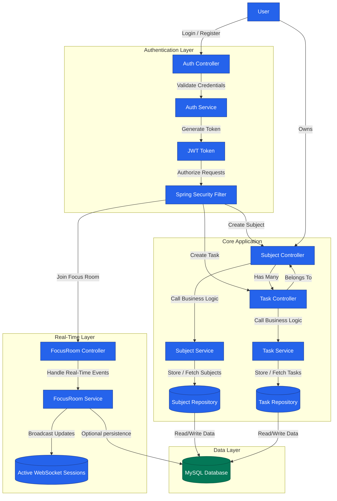

# 📚 StudyFlow: Smart Academic Planner

**StudyFlow** is a **Spring Boot** backend that helps students plan, track, and manage their study activities efficiently. Users can create subjects, manage tasks, and collaborate in real-time focus rooms with Pomodoro timers. The backend ensures secure authentication using JWT and isolates user-specific data.

---

## 📌 Features Implemented ✅
- **🔐 JWT Authentication**
  - Register and login with secure JWT tokens.
  - Ensures each user accesses only their own data.
- **📚 Subject Management**
  - Create, read, update, and delete subjects.
  - Subjects are scoped per authenticated user.
- **📝 Task Management**
  - CRUD operations for tasks under each subject.
  - Tasks include title, description, and due dates.
- **⏱ Real-Time Focus Rooms**
  - Join collaborative study sessions with Pomodoro timers.
  - Real-time updates using **WebSocket + STOMP**.

---

## 🚀 Tech Stack
| Layer | Technology |
|-------|------------|
| Backend | Spring Boot (Java) |
| Database | MySQL (Dockerized recommended) |
| Authentication | JWT + Spring Security |
| Real-Time | WebSocket + STOMP |
| Build | Maven |
| Testing | JUnit |


## 🛠️ Getting Started

### **Prerequisites**
- Java 17+
- Maven
- MySQL
- Docker (if using Dockerized MySQL)


### **Setup**
1. Clone the repository:
```bash
git clone https://github.com/Chaitanya3107/StudySync.git
cd StudySync
```
2. Build the project with Maven:
```bash
./mvnw clean install
```
4. Configure application.yml with your database credentials.

5. Run the Spring Boot application:
   ```bash
   ./mvnw spring-boot:run
   ```
6. Access API endpoints via http://localhost:8080/.

---

## 🧩 API Flow Diagram



## 📦 Future Work
  - Scheduled Email Reminders - Send automatic email notifications for incomplete tasks.
  - AI Study Assistant - Integrate Spring AI to summarize notes and answer study questions.
  - AWS Deployment - Deploy backend on AWS EC2 with S3 for storage of uploaded files.


  
